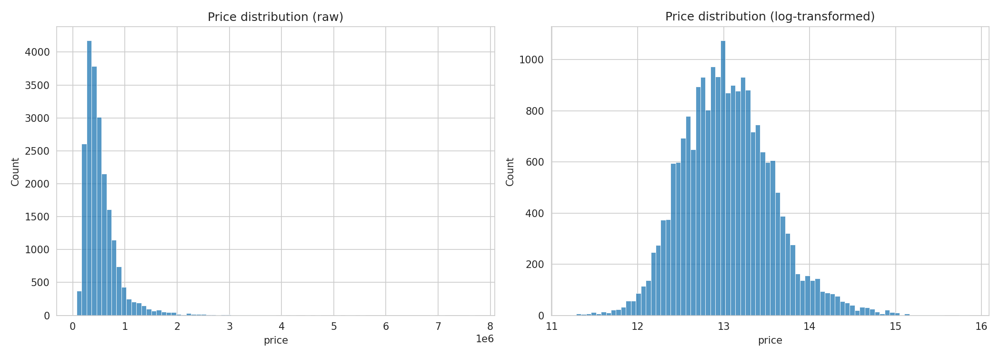
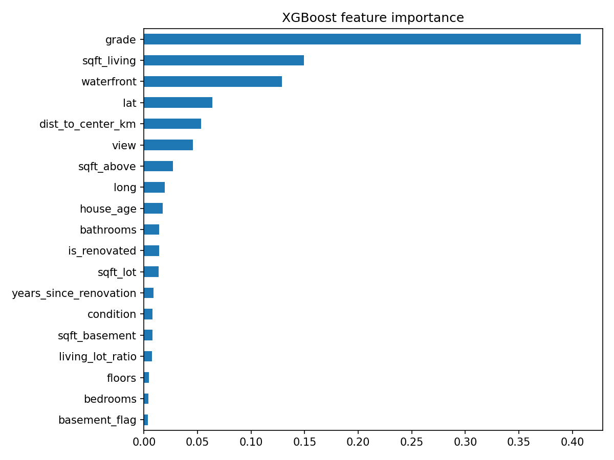
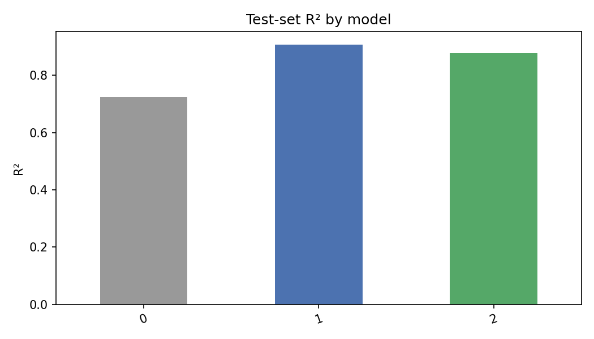
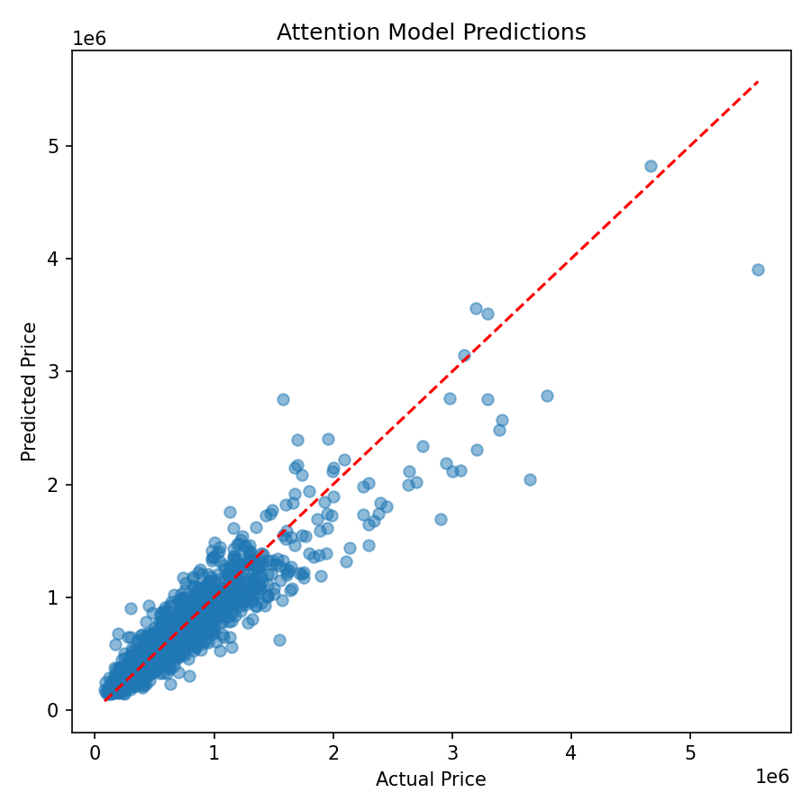

# 🏠 Smart Housing Price Analytics

<p align="center">
  <b>Data-driven property valuation with machine learning and spatial intelligence.</b>
</p>

<p align="center">
  
  
  
  
  
  
</p>

---

## 💼 Business Problem

Property valuation depends on more than the physical characteristics of a home.  
**Location, neighbourhood context, property quality, and comparable nearby sales** can all influence market value.

This project explores how machine learning can combine these signals to build a reliable automated property valuation system.

**Key question:**

> Can neighbourhood-aware modelling improve residential price prediction beyond conventional machine learning?

---

## 📊 Solution

The system combines:

- 🏡 Property characteristics
- 📍 Geographic location
- 🕒 Property age and renovation history
- 📐 Engineered valuation features
- 🗺️ Nearby comparable properties
- 🤖 Machine learning predictions

A spatial KNN graph identifies the **10 nearest properties** for each home, while an attention mechanism learns which nearby properties are more relevant to valuation.

---

## 📈 Performance

Tested on the same held-out dataset:

| Model | MAPE ↓ | RMSE ↓ | R² ↑ |
|---|---:|---:|---:|
| Linear Regression | 25.67% | $186K | 0.723 |
| **XGBoost** | **12.14%** | **$108K** | **0.907** |
| Spatial Attention | 13.69% | $124K | 0.877 |

### 🏆 Result

**XGBoost delivered the strongest predictive performance**, achieving an R² of **0.907** and MAPE of **12.14%**.

The spatial attention model did not outperform XGBoost, but demonstrated how **neighbourhood relationships can be explicitly incorporated into automated valuation** and analysed through attention-based spatial reasoning.

---

## 🔍 Insights

- Living area and property quality are important valuation signals.
- Geographic information provides additional market context.
- Nearby properties can be modelled as comparable homes rather than independent observations.
- Strong tabular models remain highly competitive for structured housing data.
- Spatial modelling creates opportunities for more interpretable neighbourhood-aware valuation systems.

---

## 🖼️ Project Highlights

<p align="center">
  
  
</p>

<p align="center">
  
  
</p>

---

## 🛠️ Built With

**Python · Pandas · NumPy · Scikit-learn · XGBoost · PyTorch · Matplotlib · Seaborn · Folium · Jupyter**

---

## 🚀 Project Workflow

```text
Housing Data
     ↓
Data Quality & Exploration
     ↓
Feature Engineering
     ↓
Machine Learning
     ↓
Spatial Neighbourhood Graph
     ↓
Attention-Based Valuation
     ↓
Performance & Error Analysis

---

## 🔮 Next Direction

The framework can be extended toward:

GAT / GATv2 · GraphSAGE · Spatial Cross-Validation · SHAP Explainability · Neighbour Attention Visualisation · Interactive Property Valuation

---

## 👩‍💻 Author

Megha Kalachira Ankush

MSc Data Analytics · B.Tech Computer Science Engineering

GitHub⁠:https://github.com/MeghaKA/Smart-Housing-Price-Analytics

---

## 📄 License

Released under the MIT License.

This version is the one I'd recommend for your repository: **business-oriented, concise, visually attractive, and still technically credible**. It tells a recruiter or hiring manager within a minute **what problem you solved, what you built, what the result was, and why the project is interesting**.
